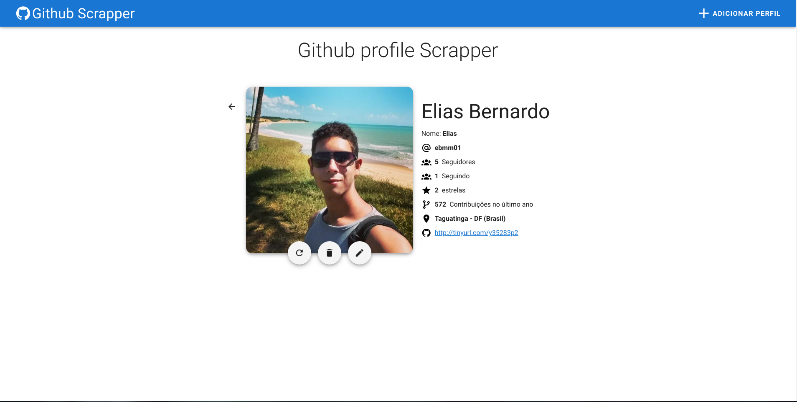
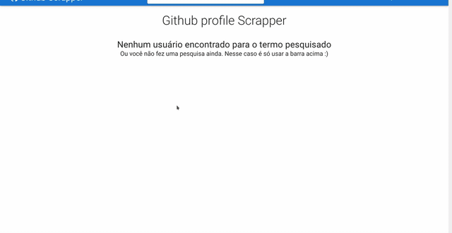

# Fretadão challenge



Repositório com o projeto relativo ao desafio do Fretadão. Ele é dividido em api e front, onde em api/ está o projeto em __Rails__ e front/ o front-end do projeto, feito em __VueJs__. O deploy pode ser encontrado nos seguintes links: 

Front-end (completo): [https://fretadao-challenge.netlify.app/#/](https://fretadao-challenge.netlify.app/#/) 

> Obs.: O front usa a api para fazer as chamadas, e como o deploy da api foi feito no free-tier do Heroku pode haver uma lentidão ao fazer a primeira busca. Mas não se assuste, é apenas o dyno que estava "dormindo". Após a primeira requisição ser feita as demais ficam normais. Note que após alguns minutos a API pode voltar a "dormir" novamente.

API: [https://fretadao-challenge.herokuapp.com/](https://fretadao-challenge.herokuapp.com/)

## Executando a aplicação localmente

Caso prefira, você pode executar a aplicação localmente. Para isso é só clonar o repositório e seguir os passos abaixo:

### Back-end (API)

É necessário ter o [Ruby](https://www.ruby-lang.org/pt/documentation/installation/) e a Gem [Rails](https://guides.rubyonrails.org/v6.0/getting_started.html#creating-a-new-rails-project-installing-rails). Recomenda-se utilizar a versão __6.0.3.2__ do Rails e __2.7__ do Ruby.

Após instalar ambos, verifique se consegue executar o rails. Para isso, abra um terminal e digite:

    rails -v

O comando deve retornar a versão instalada do Rails. Por exemplo `Rails 6.0.3.2`. Na sequencia entre na pasta da API com o comando

    cd api/

Instale as dependências necessárias

    bundle install

E execute o server:

    rails s

Caso tudo ocorra com sucesso uma tela parecida com a abaixo irá surgir:

```
=> Booting Puma
=> Rails 6.0.3.2 application starting in development 
=> Run `rails server --help` for more startup options
Puma starting in single mode...
* Version 4.3.5 (ruby 2.7.1-p83), codename: Mysterious Traveller
* Min threads: 5, max threads: 5
* Environment: development
* Listening on tcp://127.0.0.1:3000
* Listening on tcp://[::1]:3000
Use Ctrl-C to stop
```

Pronto, o server já está rodando corretamente!

> __Obs.:__ O back-end utiliza uma chave secreta para acesso ao banco, que está no arquivo `config/application.yml`. Por padrão o arquivo é ignorado, então caso não o tenha em mãos é necessário criá-lo, inserindo a chave `MONGO` conforme o exemplo abaixo:

    MONGO: <string de acesso>

### Front-end

Para o front, é necessário ter o [Node](https://nodejs.org/en/) instalado. Recomenda-se utilizar a versão LTS, que no momento de escrita desse readme é a 12.18.3
Assim como o ruby, após instalar o node você pode verificar a versão com `node -v`, que deve retornar algo como `v12.18.3`. 

Na sequência acesse a pasta do projeto vue com o comando

    cd front/

E instale as dependências necessárias com o comando

    npm install

A instalação demora um pouco. Se preferir você pode utilizar o Yarn. Após finalizar a instalação crie um arquivo chamado `.env`, inserindo a variável `VUE_APP_BACKEND_API`. Caso tenha seguido o tutorial acima o arquivo deve ficar da seguinte forma:

    VUE_APP_BACKEND_API=http://localhost:3000

> Caso a sua API esteja rodando em outra porta ou host, é só alterar o dado correspondente.

Por fim execute o front com o comando:

    npm run serve

Caso tudo rode com sucesso você um log parecido com o abaixo: 

```
App running at:
- Local:   http://localhost:8080/ 
- Network: http://192.168.0.10:8080/
```

Para acessar é só abrir um navegador de preferência e acessar o link [http://localhost:8080/](http://localhost:8080/).

## Implementações, escolhas e justificativas

### API

Apesar de uma implementação monobloco suprir perfeitamente a necessidade do desafio, o projeto foi realizado com o rails api para facilitar a implementação do front utilizando Frameworks JS SPA e permitir que o back-end fosse consumido por qualquer outra aplicação facilmente.

#### Banco de dados - Mongo

Por padrão o Rails utiliza bancos de dados relacionais, porém aqui optei por utilizar um banco orientado a documentos (MongoDB). Dessa forma não foi necessário trabalhar com migrações, e alterações na schema do Usuário puderam ser feitas de forma muito mais rápida por não impactar diretamente o banco. Além disso também foi possível utilizar o [MongoDB Atlas](https://www.mongodb.com/cloud/atlas), um banco cloud, sendo criado um cluster específico para o projeto, dispensando assim a necessidade de instalar o MongoDB na máquina de quem for executar o projeto. 

#### Implementação em Libs/

Tanto o __Scrapper__ quando o __URLHandler__ foram implementados como libs e estão dentro da pasta `lib/services`. A implementação dessa forma tem por objetivo melhorar a manutenabilidade, de forma que ambos são consumidos nas models. Se em algum momento futuro fosse necessário alterar algo na implementação deles, a model ficaria a princípio intocada, e somente __Scrapper__ ou __URLHandler__ seriam alterados. Tal abordagem também facilita a implementação de testes unitários.

#### Scrapper

O __Scrapper__ utiliza a gem `nokogiri`. A gem foi escolhida por facilitar a implementação do scrapper, permitindo utilizar facilmente seletores CSS para identificar os elementos.

O Scrapper espera uma url __desencurtada__ no construtor, e a partir dela pode buscar os dados de um usuário. Você pode checar se o perfil de um usuário foi encontrado com o método __check_user_existence__. Caso ele retorne false o perfil não foi encontrado. Do contrário os métodos retornam corretamente os dados encontrados de um usuário. 

Um exemplo de utilização pode ser visto abaixo: 

```
scrapper = Scrapper.new(url) # Onde url deve ser um link do github.

if scrapper.check_user_existence
    # Posso chamar os métodos do scrapper
    # ex.: profile_image = scrapper.get_profile_image 
    # Retorna a imagem de perfil do usuário 
else
    # Usuário não existe, implementar a lógica necessária para tratar esse fluxo
end
```

A utilização dele no projeto é feita dentro da model, sendo chamado implicitamente ao criar um usuário (ou seja, de forma automática e transparente para o client) ou explicitamente ao refazer o scrapper.

#### URLHandler

Para tratar o encurtamento de URL's foi criado uma classe que expõe dois métodos estáticos: __shorten__ e __unshorten__. As gems utilizadas foram __shorturl__, que permite encurtar facilmente urls sem que seja necessário utilizar chaves de acesso, e __embiggen__, que permite desencurtar URL's de diversos encurtadores. 

A gem __shorturl__ foi utilizada com suas configurações padrões, logo o encurtamento é feito com o [__tinyurl__](https://tinyurl.com/). A implementação de um desencurtador, apesar de não ser obrigatória, foi necessária pelo fato de o __Scrapper__ esperar uma url desencurtada. Logo, como seria necessário encurtar e desencurtar urls, o URLHandler foi criado expondo ambas implementações.  

#### Demais gems

- mongoid_search => Gem utilizada para pesquisa full text. Ela é utilizada na implementação com o mongoid, driver mongo utilizado no rails.
- figaro => Utilizado para inserir variáveis de ambiente. No projeto foi utilizado para a string de conexão do banco com o Atlas.
- httparty => Utilizado em conjunto do __Scrapper__, abstrai a abertura de páginas http. 

### Front End 

Para o front end o framework escolhido foi o [__VueJs__](https://vuejs.org/). A preferência foi completamente pessoal, visto que trabalho com ele há mais de 1 ano, conhecendo o funcionamento dele. Também foi utilizada a biblioteca [__Vuetifyjs__](https://vuetifyjs.com/) para os componentes, por já disponibilizar diversos componentes com a filosofia do Material Design. A estilização foi feita utlizando o pré-processador __SCSS__, que facilita a implementação de blocos css. Apesar de o scss permitir a utlização de variáveis, permitindo a criação de uma folha de estilo, pela simplicidade do projeto elas não foram utilizadas.

## Limitações e melhorias

TODO

## Breve gif



